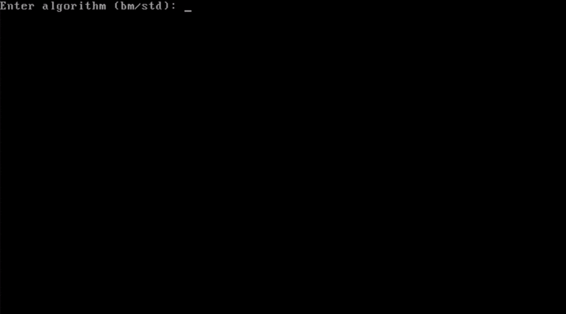

<h1 align="center">StringsOS</h1>

<p align="center">
  
</p>

A minimal x86 operating system built from scratch — a 16-bit real-mode bootloader (FASM) that loads a freestanding C++ kernel, which brings up its own IDT/PIC/keyboard driver and runs an interactive shell. The theme of the shell is string processing: at boot you pick between two substring-search algorithms, then use the shell to try them out.

## What it does

**At boot**, the bootloader prompts:

```
Enter algorithm (bm/std):
```

- `bm` — [Boyer-Moore](https://en.wikipedia.org/wiki/Boyer%E2%80%93Moore_string-search_algorithm) string search
- `std` — naive (brute-force) substring search

The chosen mode is passed to the kernel, which then boots into a shell:

| Command | What it does |
|---|---|
| `info` | Author, OS, bootloader, compiler, and current search mode |
| `template <text>` | Load `<text>` into memory as the search pattern (also prints the Boyer-Moore shift table when in `bm` mode) |
| `search <text>` | Search `<text>` for the loaded template using the selected algorithm |
| `upcase <text>` / `downcase <text>` / `titlize <text>` | Case transforms, printed directly |
| `shutdown` | Power off (via ACPI) |

Everything — the bootloader, protected-mode switch, GDT, IDT, PIC remapping, PS/2 keyboard scancode handling, VGA text-mode output, and the shell itself — is hand-written, no OS libraries or firmware services beyond BIOS interrupts in the boot sector.

## Running it

### Docker (recommended — no toolchain to install)

The only non-trivial part of containerizing this is that QEMU normally opens a native GUI window (`-display sdl`), which a container doesn't have. This setup instead runs QEMU with a VNC display and serves it to your browser via [noVNC](https://novnc.com/), so `docker compose up` is genuinely all you need — no X11/XQuartz setup on the host.

```bash
docker compose up --build
```

Then open **http://localhost:6080/vnc.html?autoconnect=true&resize=scale** in your browser. Click into the screen to focus it, then type as usual — keyboard and mouse are forwarded over VNC.

Notes:
- The bootloader/kernel toolchain includes [FASM](https://flatassembler.net/), which only ships as a 32-bit x86 binary (no arm64 build) — the image is built for `linux/amd64` and runs under emulation on Apple Silicon / arm64 hosts. It's a tiny bare-metal build, so this has no noticeable performance impact.
- To stop: `docker compose down`.

### Natively (Linux/macOS with the toolchain installed)

Requires [`fasm`](https://flatassembler.net/), a 32-bit-capable `g++`/`ld` (`gcc-multilib`/`g++-multilib` on Debian/Ubuntu), and `qemu-system-i386`.

```bash
./run.sh --build   # build and run
./run.sh           # run the last build again
```

This opens QEMU directly in a native SDL window.

## Project layout

```
src/
  bootsect.asm   16-bit real-mode bootloader (FASM): mode prompt, A20, GDT, protected-mode switch, kernel load
  kernel.cpp     freestanding C++ kernel: IDT/PIC/keyboard driver, VGA output, shell, search algorithms
run.sh           native build/run script
Dockerfile       containerized build + QEMU/noVNC runtime
docker-compose.yml
```

## License

[MIT License](LICENSE)
